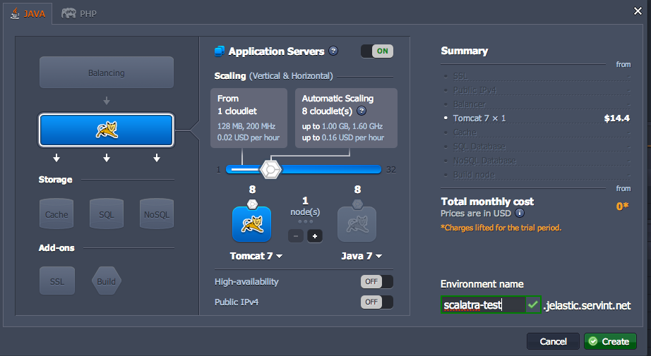

[Jelastic](http://jelastic.com/) is a cloud application platform designed specifically
for servlets like Scalatra apps.
Jelastic allows you to scale your app both horizontally (more instances) and vertically
(more powerful instances).
They offer a 2-week free trial, after which point their rates are among the best in the industry.

<div class="alert alert-info">
  <span class="badge badge-info"><i class="icon-flag icon-white"></i></span>
  See
  <a href="{{site.examples}}deployment/scalatra-jelastic">scalatra-jelastic</a>
  for a minimal and standalone project containing the example in this guide.
</div>

----

## 1. [Register](http://jelastic.com/) for an account.
Jelastic is a platform with many hosts to choose from.
**In this guide we'll assume you've chosen LayerShift as your host.**

## 2. Create an environment.
An "environment" in Jelastic-speak is a selection of a servlet container and any add-ons
(like databases) that you may want.

On your [management console](https://app.j.layershift.co.uk/) click
"Create environment."

<a href="jelastic-screenshot.png"></a>

You need to choose an environment name that is unique across the entire Layershift host.
**We'll proceed with the environment name `scalatra-test`, but yours will necessarily be
different.**
The default of Tomcat 7 automatically scaling between 1 and 8 cloudlets is fine for us.

## 3. Set up a project.

- Create a Scalatra project from the usual Scalatra giter8 template.
Check out the the [installation]({{site.baseurl}}getting-started/installation.html) and [first project]({{site.baseurl}}getting-started/first-project.html) guides if this isn't familiar.

```sh
$ g8 scalatra/scalatra-sbt -b develop
$ cd [app root]
$ chmod u+x sbt
```

- Install the Jelastic deployment plugin

Add the following line to `project/plugins.sbt`:

```scala
addSbtPlugin("com.github.casualjim" % "sbt-jelastic-deploy" % "0.1.4")
```

- Configure the Jelastic deployment plugin

Add the following lines to `buid.sbt`.
You will need to replace `"scalatra-test"` with the name of your environment.

```scala
seq(jelasticSettings:_*)

JelasticKeys.email in JelasticKeys.deploy := sys.env.get("JELASTIC_USERNAME").getOrElse(
sys error "Please export JELASTIC_USERNAME in your shell!"
)

JelasticKeys.password in JelasticKeys.deploy := sys.env.get("JELASTIC_PWD").getOrElse(
sys error "Please export JELASTIC_PWD in your shell!"
)

JelasticKeys.apiHoster := "app.j.layershift.co.uk"

JelasticKeys.environment in JelasticKeys.deploy := "scalatra-test"

publishTo := None
```

## 4. Configure your environment
You weren't thinking of storing your username and password in version control, were you?

Open `~/.bash_profile` on Mac, or `~/.bashrc` on Linux, and add these lines,
substituting your Jelastic username and password as appropriate:

```
export JELASTIC_USERNAME="you@you.com"
export JELASTIC_PWD="iluvyou"
```

Now close your shell and open a new one.

## 6. Deploy
With the project set up, your first deploy, and all future deploys, are insanely easy:

```sh
$ cd [app root]
$ ./sbt
> deploy
```

If all has gone well you'll a ton of output.
Here's an abbreviated example:

```
> deploy
[info] Compiling 2 Scala sources to /Users/yuvi/Desktop/my-scalatra-web-app/target/scala-2.9.2/classes...
[info] Packaging /Users/yuvi/Desktop/my-scalatra-web-app/target/scala-2.9.2/my-scalatra-web-app_2.9.2-0.1.0-SNAPSHOT.war ...
[info] Done packaging.
SLF4J: Failed to load class "org.slf4j.impl.StaticLoggerBinder".
SLF4J: Defaulting to no-operation (NOP) logger implementation
SLF4J: See http://www.slf4j.org/codes.html#StaticLoggerBinder for further details.
[info] Jelastic session: 62e8x8c50adf7c46f3459f851617020ef8a53
[info] Upload of http://6e49611e3c2db05e830d2d4c9381469a.app.j.layershift.co.uk/xssu/rest/download/RDYYHFdvUVcIBl5JYldpTUAXDBQFHkQWCEE%2BGSgndlVHHkZZDwQBQmNTTEBI with size 22548400 succeeded.
[info] File registration for developer 25320 success
[info] Deploy success
[info] Stopping tomcat:
[info] Waiting for processes to exit..
[info] Waiting for processes to exit..
[info] Waiting for processes to exit..
[info] Sending the Tomcat processes a SIGTERM asking them to shut down gracefully..
[info] [  OK  ]
[info] --2012-12-16 22:44:39--  http://6e49611e3c2db05e830d2d4c9381469a.app.j.layershift.co.uk/xssu/rest/download/RDYYHFdvUVcIBl5JYldpTUAXDBQFHkQWCEE%2BGSgndlVHHkZZDwQBQmNTTEBI
[info] Resolving 6e49611e3c2db05e830d2d4c9381469a.app.j.layershift.co.uk... 207.58.158.90
[info] Connecting to 6e49611e3c2db05e830d2d4c9381469a.app.j.layershift.co.uk|207.58.158.90|:80... connected.
[info] HTTP request sent, awaiting response... 200 OK
[info] Length: 22547738 (22M) [application/octet-stream]
[info] Saving to: `/opt/tomcat//webapps/ROOT.war'
[info]
[info]      0K .......... .......... .......... .......... ..........  0% 41.6M 1s
[info]     50K .......... .......... .......... .......... ..........  0% 38.8M 1s
[info]    100K .......... .......... .......... .......... ..........  0% 60.6M 0s
[info]    150K .......... .......... .......... .......... ..........  0% 35.5M 1s
[info]  21900K .......... .......... .......... .......... .......... 99%  145M 0s
[info]  21950K .......... .......... .......... .......... .......... 99%  148M 0s
[info]  22000K .......... .........                                  100% 91.6M=0.3s
[info]
[info] 2012-12-16 22:44:52 (69.8 MB/s) - `/opt/tomcat//webapps/ROOT.war' saved [22547738/22547738]
[info]
[info] Starting tomcat: [  OK  ]
[info] Logged out of jelastic.
[success] Total time: 210 s, completed Dec 16, 2012 2:45:04 PM
```

## 7. Visit your website

Since we used the environment `scalatra-test`, the app is now live at [http://scalatra-test.j.layershift.co.uk](http://scalatra-test.j.layershift.co.uk).
As always, you will have to substitute your environment name into that URL.
