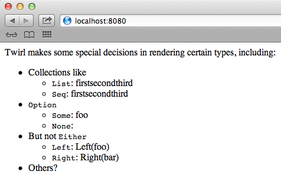

*Twirl* is the [Play 2 templating language](http://www.playframework.org/documentation/2.0/ScalaTemplates).

<div class="alert alert-info">
  <span class="badge badge-info"><i class="icon-flag icon-white"></i></span>
  Please note that the example for this guide needs to be updated to work with
  Scalatra 2.3.x / Scala 2.11.x.
  <!-- See
  <a href="{{site.examples}}views/scalatra-twirl">scalatra-twirl</a>
  for a minimal and standalone project containing the example in this guide. -->
</div>

---

## Evaluating Twirl

While the Scalatra developer generally prefer [Scalate](scalate.html) for server-side
templating, Twirl provides an interesting alternative.

### Advantages of Twirl

- Templates are rendered by simply calling a generated `render` function with the
correct arguments.
Since this call can be made from other templates, the artificial distinction between
"layouts" and "views" is erased.
- Twirl simply embeds Scala in arbitrary text, whether that text is HTML, JSON, XML, or
anything else. There is no new language to learn.
- When you use Twirl, the compiler can check type errors *within* a template, but
unlike Scalate it can also check that templates are being passed the right parameter
types.

### Disadvantages of Twirl

- Play 2 is legendary for its slow compile times, and the code Twirl produces is a
major offender in that regard.
If your project involves many templates, compile times will get progressively worse.
- Since Twirl is a general-purpose template languages, it is not nearly as DRY as
Scalate's Scaml or Jade languages for HTML/XML templates.
- There is no tooling support for Twirl. Get ready to hit the space and tab keys often.
- Twirl makes some undocumented rendering decisions with respect to certain types
(see below).

## Using Twirl

### Installation ###

- Add the [Twirl plugin](https://github.com/spray/twirl) to `project/plugins.sbt`:

```scala
addSbtPlugin("io.spray" % "sbt-twirl" % "0.6.1")
```
- Enable the plugin in `build.sbt`:

```scala
seq(Twirl.settings: _*)
```

### Usage ###

You add your templates to `src/main/twirl`.
Twirl files are of the form `[name].scala.[format]`. For example, `foo.scala.html` or
`bar.scala.xml`.
The package of the generated Scala file will follow the name of the template file,
and its path.

For example, if you create a file
`src/main/twirl/com/example/myTwirlTemplate.scala.html`, the resulting Scala file
will be in the package `com.example.html`.

You can call it with:

```scala
com.example.html.myTwirlTemplate.render(param1, param2, ...)
```

## A basic example ##

Create `src/main/twirl/org/scalatra/example/hello.scala.html` with:

```html
@(date: java.util.Date)

<html>
  <body>
    <h1>Twirl reporting for duty at @date.toString!</h1>
  </body>
</html>
```

Now render it in `src/main/scala/org/scalatra/example/TwirlApp.scala` with:

```scala
package org.scalatra.example

import org.scalatra._

class TwirlApp extends ScalatraServlet {

  get("/") {
    html.helloTwirl.render(new java.util.Date)
  }
}
```

Your result?

<a href="twirl-screenshot.png"></a>

## Full usage guide
We have only provided a taste of what Twirl can do.
Since it's an external project, we encourage you to also consult the
[official documentation](http://www.playframework.org/documentation/2.0/ScalaTemplates).

The [sbt plugin's README](https://github.com/spray/twirl/blob/master/README.rst)
also has a useful syntax summary.

## Rendering oddities

There are some undocumented conversions Twirl initiates before rendering. Beware!

Consider this template:

```html
@()

Twirl makes some special decisions in rendering certain types, including:

<ul>

  <li>
    Collections like
    <ul>
      <li><code>List</code>: @List("first", "second", "third")</li>
      <li><code>Seq</code>: @Seq("first", "second", "third")</li>
    </ul>
  </li>
  <li>
    <code>Option</code>
    <ul>
      <li><code>Some</code>: @Some("foo")</li>
      <li><code>None</code>: @None</li>
    </ul>
  </li>
  <li>
    But not <code>Either</code>
    <ul>
      <li><code>Left</code>: @Left("foo")</li>
      <li><code>Right</code>: @Right("bar")</li>
    </ul>
  </li>
  <li>
    Others?
  </li>
</ul>
```

It will render as:

<a href="twirl-screenshot-conversions.png">
   
</a>
